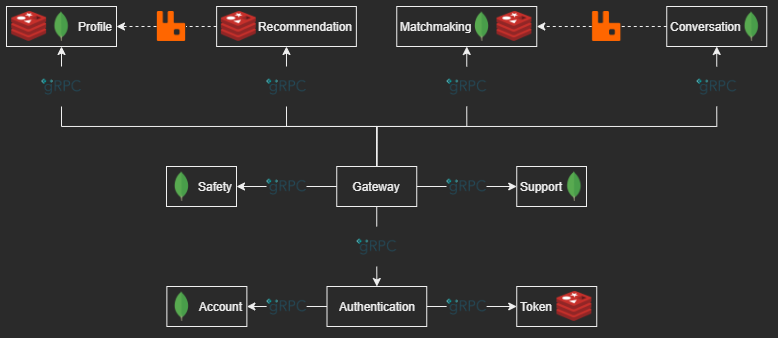

# DDDating backend

> This is an overview of the project. Go to the submodule to see the implementation details of a specific service.

Dating application backend based on the gRPC microservices ecosystem and Clean Architecture principles

____

[Try plugin for IntelliJ, make it easy to generate Protobuf code](https://plugins.jetbrains.com/plugin/21792-protobuf-blueprint)

## Installation

> docker-compose up -d

## Services:

> Details about API methods are available in each service README

- [Gateway](./service/gateway) - Entrypoint via microservices aggregation
- [Authentication](./service/authentication) - Password based authentication functionality
    - [Account](./service/account) - User account management
    - [Token](./service/token) - User authentication session handling
- [Conversation](./service/conversation) - Chat between matches
- [Matchmaking](./service/matchmaking) - Likes, dislikes with expiration and backtrack
- [Profile](./service/profile) - User profile management
- [Recommendation](./service/recommendation) - Match candidates by filters
- [Safety](./service/safety) - Profile report system
- [Support](./service/support) - Ticket based report functionality

## Architecture:

- *Clean Architecture*
- *Domain-driven design (DDD)*
- *Reactive programming*
- *Rust* workspace
- *gRPC* based microservices
- *gRPC* based gateway

## Technologies:

- **Rust** language
- **tokio** async runtime
- **tonic** gRPC implementation
- **prost** Protocol Buffers implementation
- **RabbitMQ (lapin)** message brocker
- **MongoDB** NoSQL database
- **Redis** in-memory cache
- **JWT** based authentication